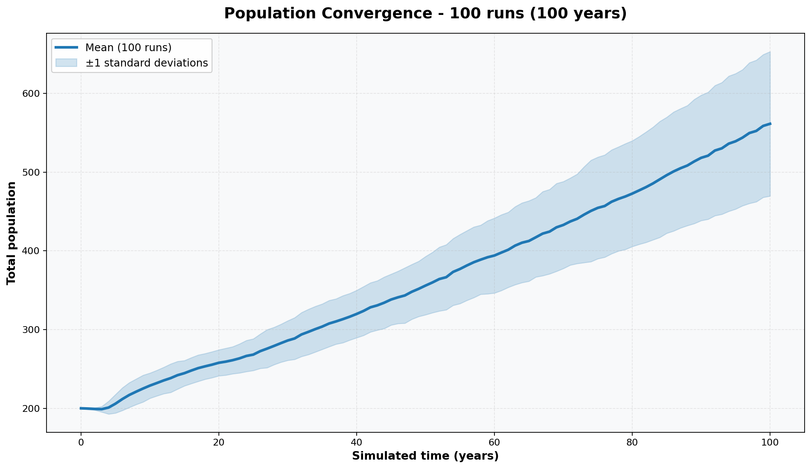

# 🧬 Human Population Simulation

A discrete-event population simulator that models demographic dynamics with life events and age-based probabilities.

## Overview 📘

This project simulates population evolution over time by modeling individuals with realistic life cycles. Each person has attributes such as age, sex, partnership status, and fertility preferences. The simulator processes stochastic events (deaths, partnerships, breakups, pregnancies) on a continuous timeline and records population size over time.

Key ideas ✨:

- Individuals are modeled as agents with ages in years and evolving social states .
- Events happen on a stochastic schedule (exponential time steps) rather than fixed monthly ticks.
- Probabilities are driven by age-range tables for mortality, pregnancy, relationship desire, and partner matching.

## Repository structure 📂

```
Population Simulation/
│
├── main.py                         # 🎯 Entry point (runs simulations & generates charts)
├── requirements.txt                # 📦 Python dependencies
├── README.md                       # 📖 Project documentation
│
├── scripts/                        # 🛠️ Core simulation modules
│   ├── person.py                   # 👤 Person data model (age, sex, partner, fertility)
│   ├── sampler.py                  # 🎲 Random sampling & exponential time-steps
│   ├── simulation.py               # ⚙️ Simulador engine (event scheduling & handlers)
│   ├── statistics_plot.py          # 📊 Multi-run stats, plotting & output handling
│   └── tables.py                   # 📋 Probability tables & age-range lookup
│
└── results/                        # 🖼️ Output charts (generated automatically)
    ├── population_growth_standard_deviation.png
    ├── population_growth_confidence_interval.png
    ├── births_confidence_interval.png
    ├── deaths_confidence_interval.png
    ├── deaths_standard_deviation.png
    ├── deaths_mean_std.png
    ├── death_age_mean.png
    ├── pairs_confidence_interval.png
    └── breaks_confidence_interval.png
```

Results 🖼️ (saved in `results/`):

- `population_growth_standard_deviation.png`: Main chart with population over time and standard deviation band.
- `population_growth_confidence_interval.png`: 95% confidence interval for population (when `--runs` > 1).
- `births_confidence_interval.png`: 95% CI for cumulative births.
- `deaths_confidence_interval.png`: 95% CI for cumulative deaths.
- `deaths_standard_deviation.png`: Standard deviation of cumulative deaths over time (when `--runs` > 1).
- `deaths_mean_std.png`: Mean ± 1 standard deviation bands for cumulative deaths (when `--runs` > 1).
- `death_age_mean.png`: Average deaths per age interval (0-12, 12-45, 45-76, 76+).
- `pairs_confidence_interval.png`: 95% CI for cumulative pairs formed.
- `breaks_confidence_interval.png`: 95% CI for cumulative breakups.

## Dependencies 📦

- Python 3.8 or newer
- `matplotlib` (see `requirements.txt`)

Install dependencies:

```bash
pip install -r requirements.txt
```

## How to run (step by step) 🚀

1. Open a terminal at the project root.
2. Install dependencies:

```bash
pip install -r requirements.txt
```

3. Run the default simulation + chart:

```powershell
py main.py
```

4. You should see a chart image like this — `population_growth_standard_deviation.png`:



5. See all available command-line options:

```powershell
py main.py --help
```

## Configuration and customization 🧪

`main.py` already exposes command-line parameters, so you can change the simulation without editing the code:

```powershell
py main.py --male_count 120 --female_count 140 --years 50 --runs 30
```

Available parameters:

- `--male_count`: initial number of males. Default: `100`.
- `--female_count`: initial number of females. Default: `100`.
- `--years`: number of years to simulate. Default: `100`.
- `--runs`: number of independent runs used to compute averages and intervals. Default: `100`.

What each parameter changes:

- More initial population changes the starting size of the simulation.
- More years extend the time horizon of the charts.
- More runs smooths the result and enables the additional confidence interval charts.

If you want to modify chart styling, output behavior, or interactive display, that is handled in `scripts/statistics_plot.py` and `main.py`.

You can also call the plotting function programmatically 🧑‍💻:

```python
from pathlib import Path
from scripts.statistics_plot import build_chart, resolve_output_path

output = resolve_output_path(Path("custom_chart.png"))
mean_final_pop = build_chart(
    male_count=120,
    female_count=130,
    years=50,
    output=output,
    runs=30,
    sigma=1,
    plot_all=False,
    show=False,
)
print(mean_final_pop)
```

## In the terminal, you should observe an output similar to the following:

```md
Running 100 simulation runs (100 years each)...
  Run 100/100... ✓
✓ Chart saved to: D:\Cybernetics\Proyectos\Population Simulation\results
✓ Chart saved to: D:\Cybernetics\Proyectos\Population Simulation\results
✓ Chart saved to: D:\Cybernetics\Proyectos\Population Simulation\results
✓ Chart saved to: D:\Cybernetics\Proyectos\Population Simulation\results
✓ Chart saved to: D:\Cybernetics\Proyectos\Population Simulation\results

Mean final population across runs: 470
```


## Notes 🧾

- The simulation is stochastic; results will vary run to run 🎲.
- Probability tables live in `scripts/table.py` if you want to explore different demographic scenarios 🔬.
